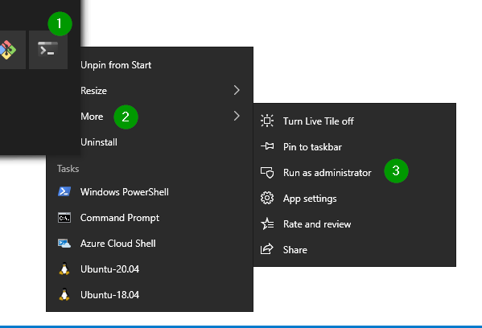
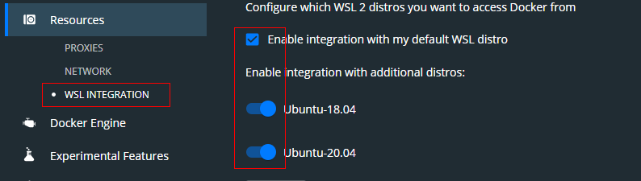
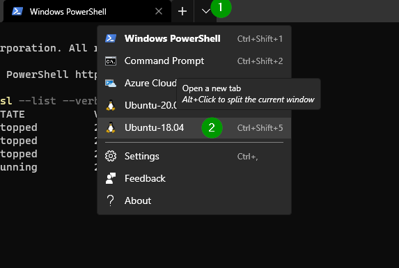

# Тестовый стенд через docker-compose и WSL

## WSL, активация, первичные настройки

### Установить windows terminal (можно это и не делать)

[Установить Windows Terminal](https://www.microsoft.com/store/productId/9N0DX20HK701)

Терминал позволяет открывать окна CMD, PowerShell, WSL-дистрибутивов, так что вполне может пригодиться.

### Активация WSL

1. Запустить терминал от имени администратора
   1. Либо правая кнопка и далее так
    
   2. Либо открыть меню пуск и начать печатать "windowster..." или "ter.." и когда появится Windows Terminal нажать Ctrl+Shift+Enter.
2. Активация WSL: ```dism.exe /online /enable-feature /featurename:Microsoft-Windows-Subsystem-Linux /all /norestart```
3. Активация функционала виртуальной машины: ```dism.exe /online /enable-feature /featurename:VirtualMachinePlatform /all /norestart```.
4. Перезагрузка.
5. Обновить ядро WSL для перехода на WSL2:
   1. Скачать ``` https://wslstorestorage.blob.core.windows.net/wslblob/wsl_update_x64.msi ```
   2. Установить.
6. Установить версию WSL2 по умолчанию.
   1. В терминале: ``` wsl --set-default-version 2 ```
7. Установить Linux distro
   1. Зайти в Microsoft Store
   2. В поиск вбить Linux
   3. Выбрать дистро и установить
8. Посмотрим, что у нас установлено из WSL
   1. В терминале: ```wsl --list --verbose```
   2. Примерный вывод в терминале:

```
    PS C:\Users\username> wsl --list --verbose
    NAME                   STATE           VERSION
    Ubuntu-20.04           Stopped         1
    Ubuntu-18.04           Stopped         2
```
9. Конвертируем дистро первой версии во вторую (Ubuntu-20.04).
   1.  ```wsl --set-version Ubuntu-20.04 2```

## Docker Desktop

[На сайте докера скачиваем](https://www.docker.com/products/docker-desktop) установочный файл, запускаем.

### Настройки Docker

#### Use the WSL2 based engine


#### Resourses


С такими настройками докер будет работать внутри Linux дистро и дополнительно ничего устанавливать не потребуется.

## Работа с Linux distro

### Запуск

Запускаем дистро из меню пуск или через терминал (картинка):



### Первичные настройки

1. Задать пользователя (для локальных тестов можно покороче)
2. Задать пароль (для локальных тестов можно покороче)

### Ставим JDK

Проверяем, есть ли у нас Java:

```java --version```

Терминал нам ответит что-то похожее на это, если Java не установлена:
```
user@qa-test-bed:~$ java --version
Command 'java' not found, but can be installed with:
sudo apt install default-jre
sudo apt install openjdk-11-jre-headless
sudo apt install openjdk-8-jre-headless
```
### Обновляемся

```sudo apt-get update && sudo apt-get upgrade```

### Устанавливаем JDK

```sudo apt-get install default-jdk```

Соглашаемся на установку и потом ждем, пока вся эта радость установится.

Ещё раз проверяем версию Java:

```java --version```

```
    PS C:\Users\username> java --version
    java 11.0.7 2020-04-14 LTS
    Java(TM) SE Runtime Environment 18.9 (build 11.0.7+8-LTS)
    Java HotSpot(TM) 64-Bit Server VM 18.9 (build 11.0.7+8-LTS, mixed mode)
```

### Прописываем переменную окружения JAVA_HOME (понадобится)

Джава вероятнее всего установилась вот так:

```/usr/lib/jvm/java-11-openjdk-amd64``` в JAVA_HOME необходимо прописывать именно этот путь, который не включает папку `bin`.

#### Редактируем файл с переменными окружения

```sudo nano /etc/environment```

добавляем на последнюю строку:

```JAVA_HOME=/usr/lib/jvm/java-11-openjdk-amd64```

Нажимаем последовательно Ctrl+S (сохранить), Ctrl+X (выйти из редактора nano).

#### Обновляем сведения о переменных окружения

```source /etc/environment```

#### Проверяем, прописалась ли переменная окружения

```echo $JAVA_HOME```

```
    username@pc:$ source /etc/environment
    username@pc:$ echo $JAVA_HOME
    /usr/lib/jvm/java-11-openjdk-amd64
```
Всё ок.

## Ставим все через docker-compose

### Selenoid

Описано здесь: https://aerokube.com/selenoid/latest/#_selenoid_with_docker_compose

#### Готовим конфиг для docker-compose

В папке проекта создаем файл `docker-compose.yml`

```yaml
version: '3.4'

services:
  selenoid:
    image: aerokube/selenoid:latest-release
    volumes:
      - "${PWD}/init/selenoid:/etc/selenoid"
      - "${PWD}/work/selenoid/video:/opt/selenoid/video"
      - "${PWD}/work/selenoid/logs:/opt/selenoid/logs"
      - "/var/run/docker.sock:/var/run/docker.sock"
    environment:
      - OVERRIDE_VIDEO_OUTPUT_DIR=work/selenoid/video
    command: ["-conf", "/etc/selenoid/browsers.json", "-video-output-dir", "/opt/selenoid/video", "-log-output-dir", "/opt/selenoid/logs"]
    ports:
      - "4444:4444"
    network_mode: bridge
```

${PWD} - текущая директория

`volumes` позволяет монтировать папки файловой системы локальной машины в контейнер.

Для строки типа `"${PWD}/init/selenoid:/etc/selenoid"` слева от двоеточия находится папка, которая лежит на локальной машине (в Linux distro), справа — на файловой системе контейнера.

##### В папке проекта создаём подпапки
- init/selenoid
- work/selenoid/video
- work/selenoid/logs

#### Файлы внутри init/selenoid

Создаём `browsers.json`

```json
{
    "chrome": {
      "default": "88.0",
        "88.0": {
          "env" : ["LANG=ru_RU.UTF-8", "LANGUAGE=ru:en", "LC_ALL=ru_RU.UTF-8", "TZ=Europe/Moscow"],
          "image": "selenoid/vnc:chrome_88.0",
          "tmpfs": {"/tmp": "size=512m"},
          "port": "4444"
        }
      }
    }
  }
```
#### Образы браузеров

Образы браузеров необходимо скачивать самостоятельно. Для примера выше потребуется образ браузера `selenoid/vnc:chrome_88.0`, он скачивается следующим образом:

```bash
docker pull selenoid/vnc:chrome_88.0
```
После этого, можно попробовать запустить то, что получилось.

#### Запуск через docker-compose

В папке проекта выполняем:

```bash
    docker-compose up
```
В консоли будет что-то вроде вот этого:

```
user@pc:/path/project$ docker-compose up
Starting project_selenoid_1 ... done
Attaching to project_selenoid_1
selenoid_1     | 2021/03/03 20:33:19 [-] [INIT] [Loading configuration files...]
selenoid_1     | 2021/03/03 20:33:19 [-] [INIT] [Loaded configuration from /etc/selenoid/browsers.json]
selenoid_1     | 2021/03/03 20:33:19 [-] [INIT] [Video Dir: /opt/selenoid/video]
selenoid_1     | 2021/03/03 20:33:19 [-] [INIT] [Logs Dir: /opt/selenoid/logs]
selenoid_1     | 2021/03/03 20:33:19 [-] [INIT] [Your Docker API version is 1.41]
selenoid_1     | 2021/03/03 20:33:19 [-] [INIT] [Timezone: UTC]
selenoid_1     | 2021/03/03 20:33:19 [-] [INIT] [Listening on :4444]
```

В браузере заходим http://your-ip-address:4444/status

Должна быть видна JSON строка `{"total":5,"used":0,"queued":0,"pending":0,"browsers":{"chrome":{"75.0":{},"76.0":{},"87.0":{},"88.0":{}}}}`

Выключаем при помощи Ctrl+C, переходим к след. шагу.

### Selenoid UI

Описано здесь: http://aerokube.com/selenoid-ui/latest/#_with_docker_compose

Добавляем в файл `docker-compose.yml` необходимое для запуска selenoid-ui:

```yaml
  selenoid-ui:
    image: "aerokube/selenoid-ui:latest-release"
    network_mode: bridge
    links:
      - selenoid
    ports:
      - "8080:8080"
    command: ["--selenoid-uri", "http://selenoid:4444"]
```


### Jenkins
