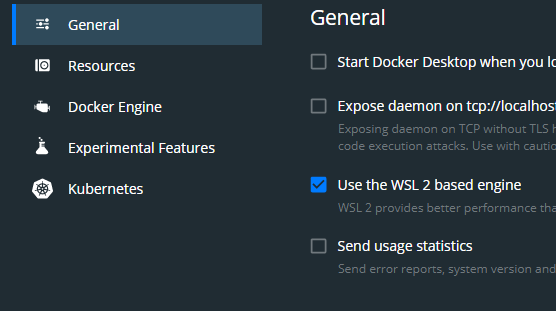

# Тестовый стенд через docker-compose и WSL

## WSL, активация, первичные настройки

### Установить windows terminal (можно это и не делать)

[Установить Windows Terminal](https://www.microsoft.com/store/productId/9N0DX20HK701)

Терминал позволяет открывать окна CMD, PowerShell, WSL-дистрибутивов, так что вполне может пригодиться.

### Активация WSL

1. Запустить терминал от имени администратора
   1. Либо правая кнопка и далее так
    
   2. Либо открыть меню пуск и начать печатать "windowster..." или "ter.." и когда появится Windows Terminal нажать Ctrl+Shift+Enter.
2. Активация WSL: ```dism.exe /online /enable-feature /featurename:Microsoft-Windows-Subsystem-Linux /all /norestart```
3. Активация функционала виртуальной машины: ```dism.exe /online /enable-feature /featurename:VirtualMachinePlatform /all /norestart```.
4. Перезагрузка.
5. Обновить ядро WSL для перехода на WSL2:
   1. Скачать ``` https://wslstorestorage.blob.core.windows.net/wslblob/wsl_update_x64.msi ```
   2. Установить.
6. Установить версию WSL2 по умолчанию.
   1. В терминале: ``` wsl --set-default-version 2 ```
7. Установить Linux distro
   1. Зайти в Microsoft Store
   2. В поиск вбить Linux
   3. Выбрать дистро и установить
8. Посмотрим, что у нас установлено из WSL
   1. В терминале: ```wsl --list --verbose```
   2. Примерный вывод в терминале:

```
    PS C:\Users\username> wsl --list --verbose
    NAME                   STATE           VERSION
    Ubuntu-20.04           Stopped         1
    Ubuntu-18.04           Stopped         2
```
9. Конвертируем дистро первой версии во вторую (Ubuntu-20.04).
   1.  ```wsl --set-version Ubuntu-20.04 2```

## Docker Desktop

[На сайте докера скачиваем](https://www.docker.com/products/docker-desktop) установочный файл, запускаем.

### Настройки Docker

#### Use the WSL2 based engine


#### Resourses


С такими настройками докер будет работать внутри Linux дистро и дополнительно ничего устанавливать не потребуется.

## Работа с Linux distro

### Запуск

Запускаем дистро из меню пуск или через терминал (картинка):


### Первичные настройки

1. Задать пользователя (для локальных тестов можно покороче)
2. Задать пароль (для локальных тестов можно покороче)

### Ставим JDK

Проверяем, есть ли у нас Java:

```java --version```

Терминал нам ответит что-то похожее на это, если Java не установлена:
```
user@qa-test-bed:~$ java --version
Command 'java' not found, but can be installed with:
sudo apt install default-jre
sudo apt install openjdk-11-jre-headless
sudo apt install openjdk-8-jre-headless
```
### Обновляемся

```sudo apt-get update && sudo apt-get upgrade```

### Устанавливаем JDK

```sudo apt-get install default-jdk```

Соглашаемся на установку и потом ждем, пока вся эта радость установится.

Ещё раз проверяем версию Java:

```java --version```

```
    PS C:\Users\username> java --version
    java 11.0.7 2020-04-14 LTS
    Java(TM) SE Runtime Environment 18.9 (build 11.0.7+8-LTS)
    Java HotSpot(TM) 64-Bit Server VM 18.9 (build 11.0.7+8-LTS, mixed mode)
```

### Прописываем переменную окружения JAVA_HOME (понадобится)

Джава вероятнее всего установилась вот так:

```/usr/lib/jvm/java-11-openjdk-amd64``` в JAVA_HOME необходимо прописывать именно этот путь, который не включает папку `bin`.

#### Редактируем файл с переменными окружения

```sudo nano /etc/environment```

добавляем на последнюю строку:

```JAVA_HOME=/usr/lib/jvm/java-11-openjdk-amd64```

Нажимаем последовательно Ctrl+S (сохранить), Ctrl+X (выйти из редактора nano).

#### Обновляем сведения о переменных окружения

```source /etc/environment```

#### Проверяем, прописалась ли переменная окружения

```echo $JAVA_HOME```

```
    username@pc:$ source /etc/environment
    username@pc:$ echo $JAVA_HOME
    /usr/lib/jvm/java-11-openjdk-amd64
```
Всё ок.


